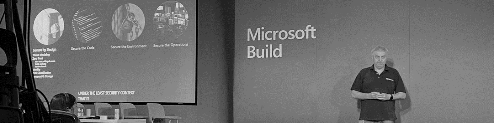

It was a pleasure to present 'Securing Applications' this week at Build UK.  Furthermore, it was fantastic to see so many people at Microsoft campus - and to know we are now back doing in-person events after the recent difficult and disruptive times.

[On-demand video](https://mybuild.microsoft.com/en-US/sessions/7afeea0f-4bac-41a7-b6af-a7df804e2323)

I have written up the content from the session.  

[Read here](https://markharrison.io/securing-applications) or [Read here](https://cloudblogs.microsoft.com/industry-blog/en-gb/technetuk/2022/06/07/considerations-for-securing-your-applications/)

